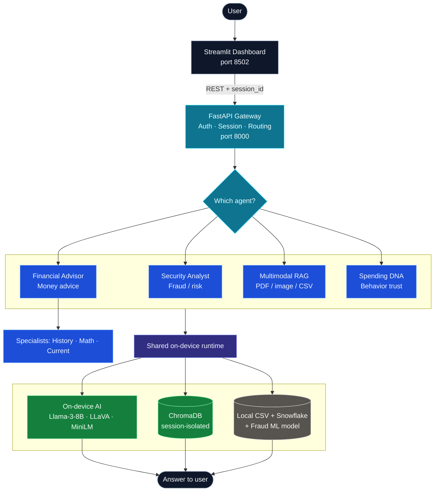

# Veriscan-Cortex — Advanced Fraud Intelligence & Private Multi-Agent Dashboard

> **Course:** CS 5588 — Data Science Capstone | **Date:** July 2026

---

## Table of Contents
- [Project Overview](#project-overview)
- [System Architecture](#system-architecture)
- [Visual Architecture](#visual-architecture)
- [Local AI Intelligence](#local-ai-intelligence)
- [Repository Structure](#repository-structure)
- [Snowflake Data Platform](#snowflake-data-platform)
- [Microservices Architecture](#microservices-architecture)
- [Quick Start](#quick-start)
- [Evaluation](#evaluation)

---

## Project Overview

Veriscan is an end-to-end **Fraud Detection & Security Platform** that processes transaction data through a multi-stage intelligence pipeline:

**Data Ingestion → Feature Engineering → Hybrid Fraud Modeling → Secure Identity Auth → Private Agentic AI**

### What is Veriscan?
The name **Veriscan** represents the fusion of two core security principles:
- **VERI** (*Verification & Veracity*): A commitment to absolute identity truth through dynamic authentication and data-backed evidence.
- **SCAN** (*Scanning & Surveillance*): The power of autonomous agentic "scans" that explore transaction history, risk profiles, and personalized financial advice.

### Specialized Agents
1. **Security AI Analyst** — Real-time fraud detection, shield monitoring, and anomaly protocols (`guard_agent_local`).
2. **Financial AI Advisor** — Credit health, savings plans, and spending optimization via a ReAct tool loop.
3. **Financial Orchestrator** — Routes questions to Historical Review, Math & Calc, and Current Analyst specialists.
4. **Multimodal Intelligence** — Session-isolated RAG over PDFs, images (OCR + Vision), CSVs, and transcripts.
5. **Spending DNA** — 8-axis behavioral fingerprinting for identity verification and trust scoring.

---

## System Architecture

Veriscan-Cortex is a **privacy-first multi-agent system**. The dashboard never loads models — it only calls the FastAPI backend. All AI runs on-device.

### How a request flows

```text
User  →  Dashboard  →  API Gateway  →  One Agent  →  Local AI / Data  →  Answer
```

1. User asks a question in the **Streamlit** dashboard (`:8502`)
2. **FastAPI** (`:8000`) authenticates the user and creates a `session_id`
3. The **Agent Router** sends the question to the right specialist
4. That agent uses **local Llama-3 / Vision / RAG** and local data — nothing leaves the machine
5. The answer returns to the dashboard

### System Diagram



| Layer | What it does | Tech |
|-------|--------------|------|
| **Dashboard** | Chat UI and charts | Streamlit, Plotly |
| **Gateway** | Login, `session_id`, API routes | FastAPI, Pydantic |
| **Agents** | One job each (security, finance, docs, DNA) | ReAct loop, tool registry |
| **On-device AI** | Reasoning, vision, search | MLX Llama-3, LLaVA, MiniLM |
| **Data** | Transactions, risk scores, uploads | CSV, Snowflake, ChromaDB |

### Security & Session Lifecycle
- **Auth Auditor**: Login is risk-scored before a `session_id` is issued.
- **Session isolation**: Uploads and agent memory stay tied to that `session_id`.
- **On-device only**: PDFs, images, and CSVs never leave the machine; embeddings use session-filtered ChromaDB.
- **HITL gating**: Sensitive tools (e.g. `challenge_auth`) need explicit `approved=True`.

---

## Visual Architecture

### Agents and their jobs

| Agent | When it runs | Output |
|-------|--------------|--------|
| **Security Analyst** | Fraud / shield / risk questions | Security audit |
| **Financial Advisor** | Money advice (ReAct tool loop) | Advisory answer |
| **Financial Orchestrator** | Complex finance questions | Routes to History / Math / Current |
| **Multimodal Expert** | Uploaded PDF, image, or CSV | Evidence-grounded answer |
| **Spending DNA** | Identity / behavior trust | 8-axis fingerprint + compare |

| Specialist (under Orchestrator) | Focus |
|---------------------------------|-------|
| Historical Review | Long-term spending patterns |
| Math and Calculation | Totals, averages, forecasts |
| Current Analyst | Last 30 / 60 / 90 days |

### Multimodal RAG pipeline

```text
PDF / Image / CSV
        │
        ▼
  Extract text (PyPDF / OCR / Vision)
        │
        ▼
  Chunk  →  Embed (MiniLM)  →  ChromaDB (this session only)
        │
        ▼
  Filter + optional rerank
        │
        ▼
  Llama-3 / LLaVA  →  Grounded answer
```

---

## Local AI Intelligence

- **Text LLM**: `Meta-Llama-3-8B-Instruct` (MLX / 4-bit)
- **Vision LLM**: `LLaVA-1.5-7B` (MLX / 4-bit)
- **Inference**: MLX-LM on Apple Silicon
- **Embeddings**: `all-MiniLM-L6-v2`
- **Optional reranker**: `cross-encoder/ms-marco-MiniLM-L-6-v2`
- **Vector DB**: ChromaDB (session metadata filtering)
- **Agent loop**: Bounded ReAct (`max_steps` / `max_tool_calls`) with JSON actions and keyword fallback

---

## Repository Structure

```
Veriscan-Cortex/
├── app/
│   └── streamlit_app.py              # Streamlit dashboard (API client)
├── src/                              # Import root (PYTHONPATH=src)
│   ├── paths.py                      # Shared data / log / Chroma paths
│   ├── agents/
│   │   ├── base.py                   # AgentAction / AgentResult interfaces
│   │   ├── react_loop.py             # Bounded ReAct JSON tool loop
│   │   ├── tool_registry.py          # Tool schemas + HITL gating
│   │   ├── trajectory_log.py         # JSONL run traces
│   │   ├── financial_advisor_agent.py
│   │   ├── financial_orchestrator.py
│   │   ├── historical_review_agent.py
│   │   ├── current_transaction_analyst.py
│   │   ├── transaction_calculation_agent.py
│   │   ├── spending_dna_agent.py
│   │   └── memory.py
│   ├── api/
│   │   ├── main.py                   # FastAPI routers & lifespan
│   │   └── schemas.py                # Pydantic models
│   └── models/
│       ├── local_llm.py              # MLX Llama-3 wrapper
│       ├── vision_llm.py             # LLaVA wrapper
│       ├── guard_agent_local.py      # Security analyst facade
│       ├── rag_engine_local.py       # Knowledge-base RAG
│       ├── multimodal_rag.py         # Session-isolated multimodal RAG
│       ├── rag_relevance.py          # Score, filter, rerank, grounded prompts
│       ├── agent_tools_data.py       # Risk / profile data tools
│       └── auth_store.py             # Demo user store
├── data/
│   ├── csv_data/                     # Transactions, scores, DNA, QA
│   ├── ic3_2024_csvs/                # IC3 crime statistics
│   ├── pdf_data/                     # RAG source PDFs
│   └── user_uploads/                 # Per-session upload sandbox
├── scripts/                          # ETL & synthetic generators
├── sql/                              # Snowflake DDL + analytical queries
├── configs/ingest_config.yaml
├── tests/                            # Offline agent & RAG evaluations
├── docs/                             # Capstone report
├── logs/                             # pipeline_logs.csv, trajectories.jsonl
├── artifacts/                        # Trained model binaries (.joblib)
├── notebooks/
├── poster/
├── run_api.sh                        # FastAPI (reload watches src/ only)
├── run_dashboard.sh                  # Streamlit dashboard
├── streamlit_app.py                  # Thin backward-compatible launcher
├── pyproject.toml                    # Package metadata (src layout)
└── requirements.txt
```

---

## Snowflake Data Platform

| Table | Purpose |
|-------|--------|
| `RAW_TRANSACTIONS` | Source transaction data |
| `TRANSACTION_FEATURES` | 19 engineered signals |
| `FRAUD_SCORES` | ML + heuristic risk scores |
| `AUTH_PROFILES` | User security profiles |
| `PIPELINE_RUNS` | Pipeline audit trail |

**Views:** `ENRICHED_TRANSACTIONS`, `USER_RISK_DASHBOARD`

See `sql/create_tables.sql` and `sql/analytical_queries.sql`.

---

## Microservices Architecture

```text
  Streamlit (:8502)                    FastAPI (:8000)
  ┌─────────────────┐                  ┌──────────────────────────┐
  │  Dashboard UI   │ ──── REST ─────► │  API Router              │
  └─────────────────┘                  │    ├─ Agents             │
                                       │    ├─ RAG + Relevance    │
                                       │    └─ Local MLX models   │
                                       └──────────────────────────┘
```

### API Endpoints

| Method | Path | Purpose |
|--------|------|---------|
| `GET` | `/api/health` | Health check & loaded services |
| `POST` | `/api/auth/login` | Demo login → `session_id` + risk scoring |
| `GET` | `/api/fraud/high-risk` | Top riskiest transactions |
| `GET` | `/api/user/{user_id}/risk` | User risk profile |
| `POST` | `/api/rag/query` | Knowledge-base semantic search |
| `POST` | `/api/rag/upload` | Multi-file upload & session indexing |
| `POST` | `/api/rag/chat` | Grounded chat over uploaded docs |
| `POST` | `/api/advisor/chat` | Financial advisor (ReAct / orchestrator) |
| `GET` | `/api/advisor/users` | Available advisor user IDs |
| `POST` | `/api/advisor/reset` | Reset advisor conversation memory |
| `POST` | `/api/security/chat` | Security analyst chat |
| `GET` | `/api/dna/profile/{user_id}` | Spending DNA fingerprint |
| `POST` | `/api/dna/compare` | Compare DNA profiles |
| `POST` | `/api/dna/challenge` | DNA challenge (HITL-gated) |

Interactive docs: `http://127.0.0.1:8000/docs`

---

## Quick Start

### 1. Requirements
- macOS with Apple Silicon (M1/M2/M3/M4)
- Python **3.11+** (see `pyproject.toml`)
- OCR: Tesseract (`brew install tesseract`) **or** the bundled RapidOCR Python fallback (`rapidocr-onnxruntime`)
- Optional Vision: `pip install mlx-vlm` (LLaVA via MLX; do not set `VERISCAN_SKIP_VISION=1`)

### 2. Install Dependencies
```bash
pip install -r requirements.txt
```

### 3. Prepare / refresh agent datasets (optional)
CSV products under `data/csv_data/` are already present for demo. To regenerate:
```bash
python scripts/generate_financial_advisor_dataset.py
python scripts/generate_spending_dna_dataset.py
python scripts/generate_cfpb_dataset.py
python scripts/feature_engineering.py
python scripts/fix_agent_data.py
```

### 4. Launch the API Backend
```bash
./run_api.sh
# equivalent:
# PYTHONPATH=src python3 -m uvicorn api.main:app --host 127.0.0.1 --port 8000 --reload --reload-dir src
```

### 5. Launch the Dashboard (separate terminal)
```bash
./run_dashboard.sh --server.port 8502
# equivalent:
# PYTHONPATH=src streamlit run app/streamlit_app.py --server.port 8502
```

On first run, Llama-3 (~4.9GB) downloads automatically via Hugging Face.

### Trajectory logging
Agent runs append to `logs/trajectories.jsonl` by default. Disable with:
```bash
export VERISCAN_TRAJECTORY_LOG=0
```

---

## Evaluation

Offline suites live under `tests/` (they prepend `src/` to `sys.path`):

```bash
PYTHONPATH=src python tests/evaluate_rag_local.py
PYTHONPATH=src python tests/evaluate_agent_local.py
PYTHONPATH=src python tests/evaluate_advisor_agent_local.py
PYTHONPATH=src python src/models/evaluate_multimodal_rag_local.py
```

---

## Reproducibility & Deployment

| Aspect | Details |
|--------|--------|
| **Environment** | Python 3.11+, `requirements.txt` |
| **Layout** | `src/` packages; launch via `run_*.sh` or `PYTHONPATH=src` |
| **Model Versioning** | `fraud_model_rf.joblib` + `encoders.joblib` (`random_state=42`) |
| **Dataset** | Synthetic + CFPB/IC3-aligned CSVs under `data/` |
| **Vector Store** | ChromaDB under `.chroma_db_local` / `.chroma_db_multimodal` |
| **Config** | `configs/ingest_config.yaml` (env overrides supported) |
| **Secrets** | Credentials via environment variables; `.env` gitignored |

## Project Data Realism

- **78% Online Skew**: Simulated fraud losses concentrated in Online Shopping / Electronics.
- **Scale**: ~**90,000 transactions** across **1,000** user archetypes.
- **DNA Fingerprinting**: Each user maps to an 8-axis behavioral vector for trust scoring.

### Source
https://consumerfed.org/press_release/americans-estimated-to-lose-119-billion-annually-to-online-scams/

Full write-up: [`docs/VERISCAN-CORTEX-FINAL-REPORT.md`](docs/VERISCAN-CORTEX-FINAL-REPORT.md)
